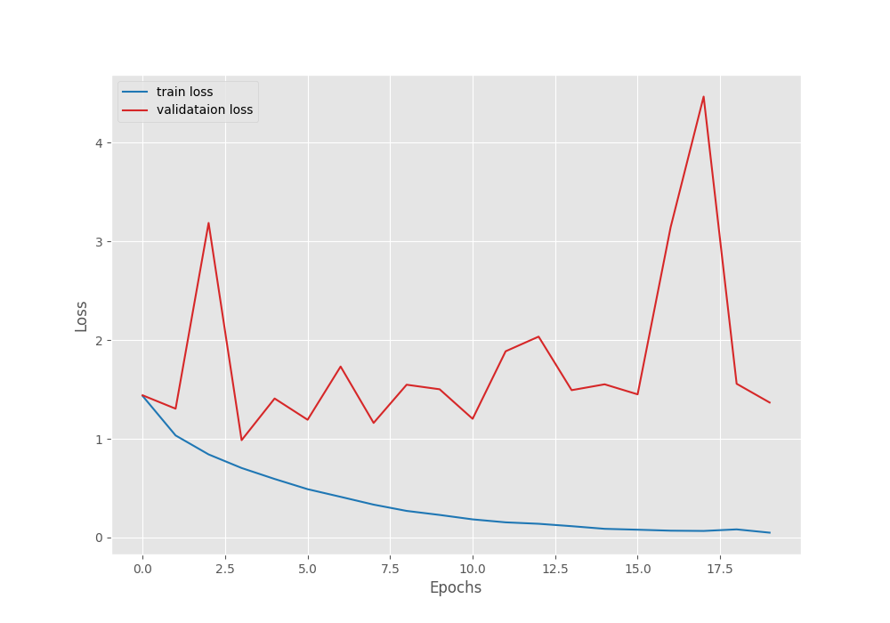

# resent18-from-scratch
Implement [resnet18](https://arxiv.org/abs/1512.03385) following [this article](https://debuggercafe.com/implementing-resnet18-in-pytorch-from-scratch/), then train on remote sensing dataset following [the second article](https://debuggercafe.com/training-resnet18-from-scratch-using-pytorch/)

## Notes on Resnet implementation
- Imagenet images are 224x224
- 5 ResNet models in paper: ResNet18, ResNet34, ResNet50, ResNet101, and ResNet152
- The numbers in the names of the models represent the total number of convolutional layers
- four different types of Basic Blocks - the only change that occurs across the Basic Blocks (conv2_x to conv5_x) is in the number of input and output channels
- The numbers beside each block represent how many times we need to repeat the Basic Blocks while building the network. It is the same (2) for all Basic Blocks of ResNet18.

<p align="center">

</p>

- Let’s call conv2_x to conv5_x as layer1 to layer4:
    * conv2_x => layer1
    * conv3_x => layer2
    * conv4_x => layer3
    * conv5_x => layer4

- Then each of the layers (or we can say, layer block) will contain two Basic Blocks stacked together. The first layer1 (`conv2_x`) is shown below:

```python
(layer1): Sequential(
    (0): BasicBlock(
      (conv1): Conv2d(64, 64, kernel_size=(3, 3), stride=(1, 1), padding=(1, 1), bias=False)
      (bn1): BatchNorm2d(64, eps=1e-05, momentum=0.1, affine=True, track_running_stats=True)
      (relu): ReLU(inplace=True)
      (conv2): Conv2d(64, 64, kernel_size=(3, 3), stride=(1, 1), padding=(1, 1), bias=False)
      (bn2): BatchNorm2d(64, eps=1e-05, momentum=0.1, affine=True, track_running_stats=True)
    )
    (1): BasicBlock(
      (conv1): Conv2d(64, 64, kernel_size=(3, 3), stride=(1, 1), padding=(1, 1), bias=False)
      (bn1): BatchNorm2d(64, eps=1e-05, momentum=0.1, affine=True, track_running_stats=True)
      (relu): ReLU(inplace=True)
      (conv2): Conv2d(64, 64, kernel_size=(3, 3), stride=(1, 1), padding=(1, 1), bias=False)
      (bn2): BatchNorm2d(64, eps=1e-05, momentum=0.1, affine=True, track_running_stats=True)
    )
  )
  ```

- Run ` python resnet18.py`: Our model model has 11,689,512 parameters and the feature map from the last convolutional layer has a 7×7 spatial dimension.

# Notes on training
- Train on the CIFAR10 dataset which contains 60k RGB images each of size 32×32 in dimension.
- Dataset is downloaded in utils.get_data
- You can train on cpu but it is slow - about 2 mins per epoch
- run `python train.py` with args `--model scratch` (this is the version in `resnet18.py`) or `--model torchvision` (loads using torchvision)

```
[INFO]: Epoch 20 of 20
Training
100%|█████████████████████████████████████████████████████████████████████████████████████████████████████████████████████████| 782/782 [01:56<00:00,  6.73it/s]
Validation
100%|█████████████████████████████████████████████████████████████████████████████████████████████████████████████████████████| 157/157 [00:06<00:00, 22.91it/s]
Training loss: 0.050, training acc: 98.256
Validation loss: 1.367, validation acc: 73.060
```

<p align="center">

</p>

<p align="center">

</p>

## Development
Uisng Github Codepsace. This provides `Python 3.10.7` and includes the following:

```
absl-py==1.2.0
astunparse==1.6.3
cachetools==5.2.0
certifi==2022.9.14
charset-normalizer==2.1.1
contourpy==1.0.5
cycler==0.11.0
flatbuffers==2.0.7
fonttools==4.37.3
gast==0.4.0
google-auth==2.11.1
google-auth-oauthlib==0.4.6
google-pasta==0.2.0
grpcio==1.48.1
h5py==3.7.0
idna==3.4
joblib==1.2.0
keras==2.10.0
Keras-Preprocessing==1.1.2
kiwisolver==1.4.4
libclang==14.0.6
Markdown==3.4.1
MarkupSafe==2.1.1
matplotlib==3.6.0
numpy==1.23.3
oauthlib==3.2.1
opt-einsum==3.3.0
packaging==21.3
pandas==1.5.0
Pillow==9.2.0
plotly==5.10.0
protobuf==3.19.5
pyasn1==0.4.8
pyasn1-modules==0.2.8
pyparsing==3.0.9
python-dateutil==2.8.2
pytz==2022.2.1
requests==2.28.1
requests-oauthlib==1.3.1
rsa==4.9
scikit-learn==1.1.2
scipy==1.9.1
seaborn==0.12.0
six==1.16.0
tenacity==8.0.1
tensorboard==2.10.0
tensorboard-data-server==0.6.1
tensorboard-plugin-wit==1.8.1
tensorflow==2.10.0
tensorflow-estimator==2.10.0
tensorflow-io-gcs-filesystem==0.27.0
termcolor==2.0.1
threadpoolctl==3.1.0
torch==1.12.1
typing_extensions==4.3.0
urllib3==1.26.12
Werkzeug==2.2.2
wrapt==1.14.1
```

A couple of additional requirements are in the requirements.txt file